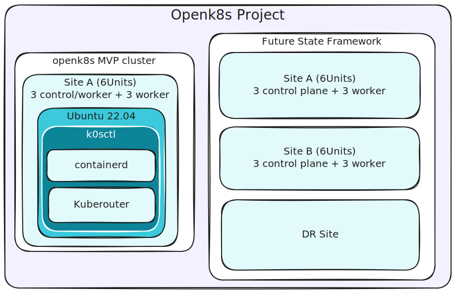
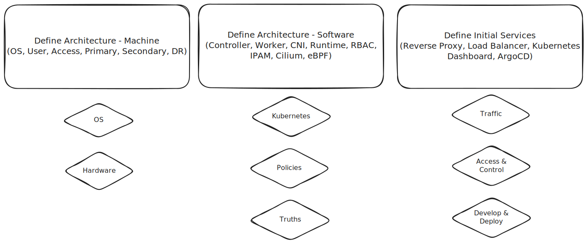

# What is open-k8s?

openk8s is a project to maintain and deploy a kubernetes cluster with a focus on security and ease of use.

The goal is to allow users to deploy a high-availability kubernetes cluster with a single command and using a single configuration file.

The current project MVP will allow developers to be able to acccess the kubernetes dashboard and deploy applications to the cluster.

The project is based on the following technologies:
- [k0s](https://k0sproject.io/): A zero-friction Kubernetes distribution.
- [kubeadm](https://kubernetes.io/docs/setup/production-environment/tools/kubeadm/): A tool to deploy production-ready kubernetes clusters.
- [microk8s](https://microk8s.io/): A lightweight kubernetes distribution.

Long term goals of the project including codifying best practices, architecture, and security configurations into GO as a common programming language to deploy the clusters maintained in this project.

## Server Hardware Reference Architecture Diagram

## GOpen-k8s Platform Design Architecture

## Deployment Options

1. [./k0s](./k0s) - Deploy a cluster using k0s as the underlying framework
2. [./kubeadm](./kubeadm) - Deploy a cluster using kubeadm as the underlying framework
3. [./microk8s](./microk8s) - Deploy a cluster using microk8s as the underlying framework

## Contributing

Please read [CONTRIBUTING.md](./CONTRIBUTING.md) for details on our code of conduct, and the process for submitting pull requests to us.
